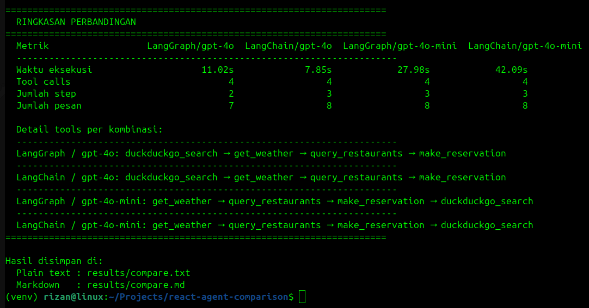

# ReAct Agent Comparison

Proyek eksperimen membangun AI Agent menggunakan dua framework berbeda untuk memahami perbedaannya:

- **LangGraph** - graph eksplisit, alur agent didefinisikan manual (nodes + edges)
- **LangChain** - graph otomatis menggunakan `create_react_agent` dari `langgraph.prebuilt`

Keduanya menggunakan tools, prompt, dan pertanyaan yang **sama persis**. Eksperimen juga membandingkan dua model OpenAI: `gpt-4o` dan `gpt-4o-mini`.

---

## Tujuan Proyek

Proyek ini dibuat sebagai bagian dari eksperimen AI Engineering untuk menjawab pertanyaan:

1. **Apa perbedaan nyata antara LangGraph dan LangChain?** - Keduanya sering disebut bersamaan, tapi cara kerjanya berbeda. Proyek ini membuktikan bahwa `create_react_agent` (LangChain) adalah shortcut dari graph yang bisa ditulis manual di LangGraph.

2. **Seberapa besar pengaruh pilihan model?** - Apakah framework yang berbeda menghasilkan perilaku berbeda, atau justru model yang lebih menentukan?

3. **Bagaimana pola ReAct bekerja dalam praktik?** - Memahami loop Reasoning + Acting secara langsung.

Dengan menjalankan **pertanyaan yang sama persis** pada 4 kombinasi (2 framework x 2 model) dan membandingkan hasilnya, perbedaan antar framework dan model bisa diamati secara objektif.

---

## Struktur Proyek

```
react-agent-comparison/
├── shared/                # Sumber kebenaran tunggal (dipakai kedua versi)
│   ├── tools.py           # Definisi semua tools
│   ├── utils.py           # Helper print message
│   ├── config.py          # Pertanyaan shared (QUESTION)
│   └── prompt.md          # System prompt
├── langgrap/              # Versi LangGraph (graph manual)
│   ├── assistant.py
│   ├── main.py
│   └── .env.example
├── langchain/             # Versi LangChain (graph otomatis)
│   ├── assistant.py
│   ├── main.py
│   └── .env.example
├── screenshots/
│   └── result.png
├── compare.py             # Script perbandingan 4 kombinasi (2 framework × 2 model)
├── results/               # Output hasil compare.py (otomatis dibuat, tidak di-commit)
│   ├── compare.md         # Hasil dalam format markdown
│   └── compare.txt        # Hasil dalam format plain text
├── requirements.txt
└── README.md
```

---

## Tech Stack

**Framework & Library:**
- [LangGraph](https://github.com/langchain-ai/langgraph) - membangun graph agent secara manual
- [LangChain](https://github.com/langchain-ai/langchain) - `create_react_agent` sebagai shortcut graph otomatis
- `langchain-openai` - integrasi model OpenAI
- `langchain-community` - DuckDuckGo search tool

**Model:**
- OpenAI `gpt-4o` dan `gpt-4o-mini` (membutuhkan API key)

**External API:**
- [Open-Meteo](https://open-meteo.com/) - data cuaca, gratis tanpa API key
- [DuckDuckGo Search](https://duckduckgo.com/) - web search, gratis tanpa API key

---

## Tools yang Digunakan

| Tool | Fungsi | Sumber |
|---|---|---|
| `query_restaurants` | Cari restoran berdasarkan kota dan jenis masakan | Mock database lokal |
| `get_weather` | Cek cuaca kota tujuan | Open-Meteo API (gratis, tanpa API key) |
| `calculate_bill_estimate` | Hitung estimasi tagihan termasuk tip | Kalkulasi lokal |
| `make_reservation` | Buat reservasi restoran | Simulasi lokal |
| `web_search` | Pencarian web untuk info lokal dan kuliner | DuckDuckGo (gratis, tanpa API key) |

---

## Cara Menjalankan

### 1. Buat virtual environment

```bash
python -m venv venv
source venv/bin/activate
```

### 2. Install dependencies

```bash
pip install -r requirements.txt
```

### 3. Buat file `.env`

Salin `.env.example` di masing-masing folder dan isi dengan API key:

```bash
cp langgrap/.env.example langgrap/.env
cp langchain/.env.example langchain/.env
```

Lalu edit kedua file:

```
OPENAI_API_KEY=your_api_key_here
```

### 4. Jalankan satu versi

```bash
# Versi LangGraph
cd langgrap && python main.py

# Versi LangChain (dari root project)
cd langchain && python main.py
```

### 5. Jalankan perbandingan

Menjalankan 4 kombinasi (2 framework × 2 model) sekaligus:

```bash
# Dari root project
python compare.py
```

Output ditampilkan di terminal dan disimpan otomatis ke `results/compare.md` dan `results/compare.txt`. Setiap run akan menimpa file sebelumnya.



---

## Alur ReAct Agent

Kedua versi menjalankan pola **ReAct** (Reasoning + Acting) yang sama:

```
                    ┌─────────────────────────────────────┐
                    │                                     │
          ┌─────────▼─────────┐                ┌──────────┴────────┐
START ──► │      REASON       │ ──tool call──► │       ACT         │
          │   (LLM berpikir)  │                │  (jalankan tool)  │
          └─────────┬─────────┘                └───────────────────┘
                    │
               tidak ada
               tool call
                    │
                   END
```

**LangGraph** - graph didefinisikan secara eksplisit:
```python
builder.add_node("reason", reason)
builder.add_node("act", act)
builder.add_edge(START, "reason")
builder.add_conditional_edges("reason", tools_condition, {"tools": "act", END: END})
builder.add_edge("act", "reason")
```

**LangChain** - graph yang sama dibuat otomatis:
```python
restaurant_assistant = create_react_agent(model=llm, tools=all_tools, prompt=...)
```

---

## Perbedaan Framework

| | LangGraph | LangChain |
|---|---|---|
| **Cara membangun agent** | Manual - definisikan node dan edge sendiri | Otomatis via `create_react_agent` |
| **State** | `TypedDict` eksplisit | Dikelola internal |
| **Graph** | `reason → act → reason` terlihat jelas di kode | Dibuat otomatis di balik layar |
| **Kontrol** | Penuh, mudah dikustomisasi | Terbatas, tapi kode lebih singkat |
| **Panjang kode assistant.py** | ~50 baris | ~20 baris |

---

## Hasil Observasi

Karena LLM bersifat non-deterministik, angka spesifik (waktu, jumlah step) akan berbeda setiap run. Bagian ini mencatat **pola umum** yang konsisten terlepas dari hasilnya.

Untuk hasil aktual dari run terakhir, lihat `results/compare.md` (di-generate otomatis oleh `compare.py`).

### 1. Framework tidak berpengaruh signifikan untuk model yang sama

LangGraph dan LangChain cenderung memanggil tools yang sama dan menghasilkan jawaban dengan kualitas yang setara - karena `create_react_agent` pada dasarnya adalah shortcut dari graph manual yang ditulis di LangGraph.

### 2. Model lebih berpengaruh daripada framework

`gpt-4o` lebih konsisten dalam:
- Mengikuti instruksi prompt (misalnya selalu memanggil `web_search` untuk pertanyaan budaya)
- Urutan tool calls yang lebih teratur dan dapat diprediksi

`gpt-4o-mini` cenderung:
- Memanggil tools dalam urutan yang berbeda setiap run
- Kadang menggabungkan atau menggeser urutan tool calls secara tidak terduga

### 3. Urutan tool calls tidak deterministik

Urutan tools yang dipanggil bisa berbeda setiap run - ini sifat alami LLM. Jika urutan eksekusi kritis untuk logika bisnis, gunakan LangGraph dengan conditional edges eksplisit, bukan mengandalkan LLM untuk memilih urutannya sendiri.

### 4. Kapan pakai LangGraph vs LangChain

**Pakai `create_react_agent` (LangChain)** jika:
- Agent sederhana dengan satu loop tool calling
- Prototyping cepat

**Pakai LangGraph manual** jika:
- Butuh urutan eksekusi yang terkontrol
- Multi-agent atau human-in-the-loop
- Logika kondisional yang kompleks antar node
